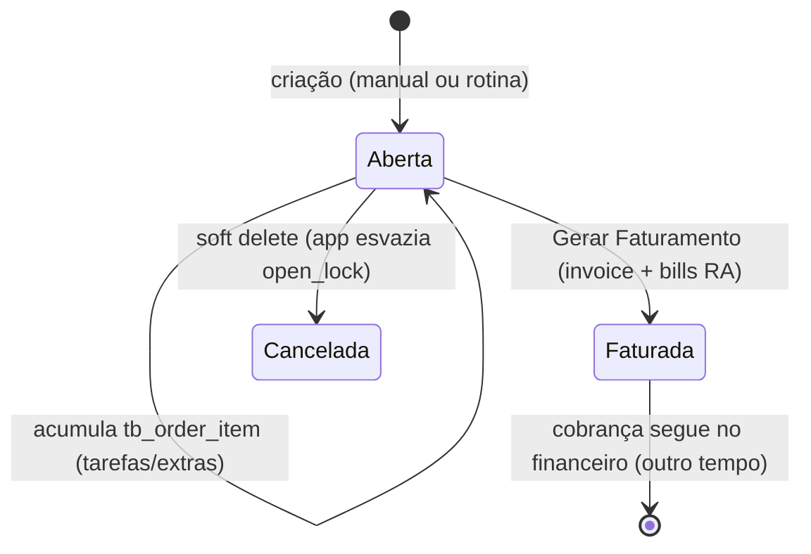

# 05 — Módulo Ordem de Serviço / Software House (Fases 2–7)

**Origem**: `Infra-IA/setes-api/prompt_modulo_software_house.md` (FECHADO —
seções 1–8 = domínio e decisões D1–D15; seção 11 = conformidade e decisões
DP1–DP12, TODAS validadas pelo Valdo em 2026-07-18).
**Status**: entregáveis das Fases 2–7 EXECUTADOS e decisões VALIDADAS
(2026-07-18). Implementação liberada para planejamento — bloqueio
remanescente: revisão do sync antes da migration em schema sincronizado.
**Implementação em ONDAS** (início 2026-07-18, "vamos implementar" do
Valdo; sync SEGUE o padrão depois — não é bloqueio):
- **Onda 1 (banco) — FEITA**: migration `013_ordem_servico.sql` (financeiro
  P6/P7/P8+5.5, parcerias com PK, tb_bank→central, item universal DP6,
  tabelas novas) + `014_product_institution_fk.sql` (FK legada do
  tb_product apontava p/ tb_institution LOCAL vazia — realinhada
  cross-schema, padrão 009/010) + sql/01 (tb_bank) + sql/03 + seed
  `sql/16` (interface 17 'contracts', flag, campos). Aplicada em dev
  (setes_setes) e verificada. Utilitários novos: `npm run db:migrate` e
  `npx tsx scripts/apply-seed.ts <seed.sql>`.
- **Onda 2 (Contratos) — FEITA**: módulo `contracts` na API (6 arquivos,
  transação com itens sincronizados por productId, lookup de produtos em
  /api/contracts/products, cliente validado no papel local; Swagger; flag
  'contracts' + defaultModules) e módulo `contracts` no app (lista+form,
  lookup cliente/produto, itens com mensalidade derivada). Smoke E2E
  POST/GET/PUT/LIST(SUM)/DELETE ok; 110/110 testes.
- **Onda 3 (Parcerias + Contas Bancárias) — FEITA (2026-07-19)**: seed
  `sql/17` (23 bancos FEBRABAN no catálogo central DP2; interfaces 18
  'partnerships'/Registers e 19 'bank-accounts'/Financial + flags +
  campos). API: módulo `partnerships` (trio sincronizado em transação;
  soma dos rates ≤ 90 no DTO e re-checada no service; **cliente só pode
  estar em UMA parceria viva — 409**, regra derivada da 4.3: a baixa
  resolve "a parceria do cliente" sem ambiguidade) e módulo
  `bank-accounts` (CRUD + lookup /banks do catálogo central). Telas
  `partnerships` e `bank_accounts` no app (agentes em paralelo, molde
  contracts). Smoke E2E dos dois ok; 110/110.
- **Onda 4 (OS/ciclo mensal + Gerar Faturamento) — FEITA (2026-07-19)**:
  1ª TELA DE PROCESSO. Seed `sql/18` (interface 20 'service-orders', grupo
  NOVO 'Services'). Migration `015_order_fks.sql` (FKs legadas da tb_order
  p/ tb_user/tb_institution LOCAIS vazias impediam abrir ordem — padrão
  009/010/014). API `service-orders`: abrir OS (trava D5 por open_lock da
  aplicação + 409), itens kind='Service' com totalizer recalculado no
  servidor, rotina mensal (transação POR CLIENTE, pró-rata 30d,
  idempotente por produto+competência, relatório
  processed/opened/injected/skipped/errors), Gerar Faturamento em
  transação única (billing → invoice 'SE' nº MAX+1 → financial + bills
  'RA' com resíduo de centavos na última parcela → status 'F' + lock
  livre) com VENCIMENTO DO USUÁRIO (DP1; GET /expiration-suggestion = só
  default), cancelamento de aberta. Funções puras em service-orders.calc
  (12 testes jest). App `service_orders`: abas Abertas/Faturadas, dialog
  de rotina com relatório, detalhe dirigido pelo estado, dialog de
  faturamento. Skill NOVA `setes-app/skills/tela-de-processo.md` (3º tipo
  de tela). Smoke E2E do ciclo inteiro ok; 122/122.
- **Onda 5 (Baixa/Estorno/Movimento) — FEITA (2026-07-19)**: seed `sql/19`
  (interface 21 'settlements', grupo Financial). API `settlements` (2ª
  tela de processo): carteira com saldo DERIVADO (tag − Σ payments 'N';
  entidade via cadeia da ordem — DP10), baixa em LOTE (settled_code MAX+1
  DP9; N payments → 1 statement; stage B/C; planos financeiros: override
  do lote > defaults da forma de pagamento — convergência com Formas v2;
  parcial permitido), estorno IMUTÁVEL (pares E/R com origin_event/
  id_origin, código próprio, statement inverso, título reaberto com stage
  'N', statement original 'E' só com o código todo estornado — P2),
  extrato com totais. REFINAMENTO contábil registrado na 6.2: saldo do
  MOVIMENTO soma N/E/R (inverso compensa aritmeticamente); status é
  visualização. App `settlements`: 3 abas (Em aberto c/ seleção múltipla
  e dialog de baixa; Baixados c/ selos N/E/R e estorno com motivo;
  Movimento c/ filtros e totais da API). Ganchos da Onda 6 comentados nos
  pontos exatos (baixa de recebimento → rotina PA; estorno → cadeia PA).
  Smoke E2E: baixa N:1 (340), estorno parcial (reabre 170, statement
  original N + inverso R), estorno total (statement E), re-baixa parcial
  (saldo 70), 409 em estorno de R, saldo real 100 ✓; 129/129.
- **Onda 6 (Rotina de Parcerias na baixa) — FEITA (2026-07-19) — MÓDULO
  COMPLETO**: baixa de RECEBIMENTO (RA/RM + operation C) de cliente com
  parceria VIVA gera, NA MESMA transação, 1 ordem PA por parceiro
  (tb_order status 'F' + tb_order_financial com colaborador e trilha
  orderId/parcel/event da baixa de origem — DP10) + título 'PA' operation
  'D' (valor = % × pago; vencimento = data da baixa + 12 dias — DP12).
  ESTORNO EM CADEIA (4.3.3 + DP11): núcleo do estorno refatorado
  transaction-aware (reverseOnePayment) e reusado recursivamente — baixas
  vigentes dos PA estornadas (pares E/R) e título de COMPENSAÇÃO 'PA'+
  operation 'C' gerado por payable (semântica invertida da 5.2; saldo
  líquido do parceiro ZERA; P10 automático segue futuro). PA pago não
  dispara parceria (só OS de cliente). Result expõe paOrders/paReversed/
  paCompensated (Swagger atualizado). Funções puras addDays/partnerShare
  (+5 testes). Sem tela nova — os títulos PA aparecem na carteira do
  settlements pela cadeia da ordem. Smoke E2E do ciclo com dinheiro
  redondo: baixa 70 → PA 21 (venc +12d) → PA pago → estorno origem →
  cadeia (1 estornada + 1 compensação) → saldo do parceiro 0 e caixa de
  volta a 100 ✓; 134/134.

**RESTANTE (fora das ondas do módulo)**: revisão do sincronizador — os
endpoints /sync/* seguem o padrão novo (decisão do Valdo: o sync não
manda, segue o padrão; será revisado como projeto próprio).

---

## Fase 2 — Modelo Conceitual (ER)

```mermaid
erDiagram
    %% ===== Backbone da ordem =====
    tb_order ||--o| tb_order_service : "especializa (id,inst,terminal)"
    tb_order ||--o| tb_order_financial : "ordem PA/PM (DP10)"
    tb_order ||--o{ tb_order_item : "detalha (kind='Service')"
    tb_order_item ||--o| tb_order_item_merchandise : "especializa mercadoria (DP6)"
    tb_order ||--o| tb_order_totalizer : "totaliza"
    tb_order ||--o| tb_order_billing : "condições de cobrança"
    tb_order ||--o| tb_invoice : "fatura interna (id compartilhado)"
    tb_customer ||--o{ tb_order_service : "no máx. 1 aberta (D5)"
    tb_collaborator ||--o{ tb_order_financial : "credor PA (via tb_entity)"

    %% ===== Contratos =====
    tb_customer ||--o{ tb_contract : "assina"
    tb_contract ||--|{ tb_contract_item : "N produtos (D9)"
    tb_product ||--o{ tb_contract_item : "precifica"
    tb_product ||--o{ tb_order_item : "serviço prestado"

    %% ===== Parcerias =====
    tb_partnership ||--|{ tb_partnership_customer : "clientes (D10)"
    tb_partnership ||--|{ tb_partnership_partner : "parceiros (soma<=90%)"
    tb_customer ||--o{ tb_partnership_customer : ""
    tb_collaborator ||--o{ tb_partnership_partner : "recebe % (bills PA)"

    %% ===== Financeiro =====
    tb_order ||--o{ tb_financial : "parcelas (faturamento)"
    tb_financial ||--|| tb_financial_bills : "título (mesma PK)"
    tb_financial ||--o{ tb_financial_payment : "baixas (PK + event)"
    tb_financial_payment }o--|| tb_financial_statement : "settled_code N:1"
    tb_payment_types ||--o{ tb_financial : "forma"

    %% ===== Bancos =====
    tb_bank ||--o{ tb_bank_account : "conta corrente"
    tb_bank ||--o{ tb_bank_historic : "históricos p/ conciliação"
    tb_bank_account ||--o{ tb_financial_statement : "0=Caixa, >0=conta"
```



### Justificativas das entidades novas/alteradas

- **`tb_order_service`** — especialização do backbone para o ciclo mensal de
  serviços: guarda o cliente e a trava de unicidade D5 (`open_lock` mantida
  pela aplicação + UNIQUE). O status A/F vive na `tb_order` (DP7 — Valdo).
- **`tb_order_financial`** — ramo novo (decisão do Valdo na DP10): entidade
  credora/devedora das ordens que nascem do financeiro (colaborador nos
  `PA`, fornecedor nos `PM`) + trilha da baixa de origem.
- **`tb_order_item` + `tb_order_item_merchandise`** — DP6 (Valdo): o item
  vira detalhe UNIVERSAL enxuto (produto/qtde/valor/desconto); estoque e
  lista de preço saem para a especialização de MERCADORIA, criada quando
  esse ramo for tratado. Serviço usa o item universal direto.
- **`tb_contract` + `tb_contract_item`** — contrato genérico por cliente com
  vigência (`dt_start` obrigatória, `dt_end` opcional) e N produtos com
  valor mensal por item (⚠️ DP3: mensalidade = SUM dos itens; sem campo
  redundante no contrato). Alimenta a rotina mensal.
- **`tb_partnership*` (realinhadas)** — o trio já existia no baseline SEM
  PK; ganham PKs compostas e `tb_customer_id` padronizado. `_customer`
  materializa D10 (nível cliente); `_partner` guarda o percentual por
  colaborador (validação dos ≤90% na aplicação).
- **`tb_financial`/`tb_financial_bills`** — PK natural
  `(inst, order, terminal, parcel)` (P7: coluna `id` vestigial removida);
  SEM coluna de entidade (DP10 — Valdo: "sempre haverá uma ordem"): o
  credor/devedor de qualquer título deriva da cadeia da ordem, inclusive
  nos `PA` (ordem própria do parceiro) e `PM` (ordem própria da despesa).
- **`tb_financial_payment`** — ganha `event` na PK (P7: baixa=1, estorno=2,
  rebaixa=3…) e os campos da imutabilidade 5.5: `status` N/E/R,
  `origin_event` (⚠️ DP5) e `reversal_reason`.
- **`tb_financial_statement`** — ganha `status` N/E/R e
  `tb_financial_statement_id_origin` (5.5); já tinha `settled_code`,
  `future`, `conferred` e os planos financeiros cre/deb.
- **`tb_bank` (central)** — catálogo de referência FEBRABAN compartilhado
  (⚠️ DP2), como tb_country; contas e históricos permanecem por schema.

---

## Fase 3 — Rotina Mensal e Transição de Estados

### 3.1 Estados da ordem de serviço (D6/D15)



**DP7 (Valdo)**: o status A/F vive em `tb_order.status` (backbone dono do
ciclo). A `tb_order_service` guarda a trava D5 em `open_lock` — coluna
NORMAL mantida pela aplicação na MESMA transação da mudança de status
(abrir = `CONCAT(inst,'-',cliente)`; faturar/cancelar = NULL).

- `Faturada` é terminal para a ordem: inadimplência/baixa é problema do
  financeiro (seção 2 do prompt). Cancelamento de ordem faturada NÃO existe
  — o caminho é estorno financeiro (Fase 6) e, se preciso, ordem nova.

### 3.2 Vencimento (DP1 REVISADA pelo Valdo, 2026-07-18)

**O usuário decide a data de vencimento na tela de Gerar Faturamento**
("podemos ter imprevistos"). O 5º dia útil deixou de ser regra — é apenas a
SUGESTÃO de default pré-preenchida na tela (usuário altera livremente):

```
função sugestaoVencimento(competencia):       # só o DEFAULT da tela
  d = primeiro dia do mês SEGUINTE à competencia
  uteis = 0
  enquanto verdadeiro:
    se diaDaSemana(d) ∈ {seg..sex}: uteis += 1   # sem feriados (P12 cancelada)
    se uteis == 5: retorna d
    d += 1 dia
```

### 3.3 Pró-rata 30 dias corridos (D2) e parcial de cancelado (D3)

```
# cliente novo no mês (contrato começou dentro da competência)
dias_ativos = dias_corridos(max(dt_start, 1º dia do mês) .. último dia do mês)
valor_item  = round(valor_mensal_item * min(dias_ativos, 30) / 30, 2)

# cliente cancelado com ordem aberta (dt_end dentro da competência)
dias_ativos = dias_corridos(1º dia do mês .. min(dt_end, último dia do mês))
valor_item  = round(valor_mensal_item * min(dias_ativos, 30) / 30, 2)
```

### 3.4 Rotina de faturamento mensal (manual, botão — D8)

Pseudocódigo (transação POR CLIENTE — falha de um não derruba o lote; a
rotina reporta sucesso/erro por cliente ao final):

```
rotinaFechamentoMensal(institutionId, competencia):
  clientes = SELECT c.* FROM tb_contract c
             WHERE c.tb_institution_id = :inst AND c.deleted='N'
               AND c.active='S'
               AND c.dt_start <= ultimoDia(competencia)
               AND (c.dt_end IS NULL OR c.dt_end >= primeiroDia(competencia))
             GROUP BY c.tb_customer_id

  para cada cliente:
    TRANSAÇÃO:
      ordem = SELECT s.* FROM tb_order_service s
               JOIN tb_order o USING (id, tb_institution_id, terminal)
               WHERE s.tb_institution_id=:inst AND s.tb_customer_id=:cli
                 AND o.status='A' AND s.deleted='N' FOR UPDATE   # DP7
      se ordem inexistente:
        criar tb_order (id MAX+1 FOR UPDATE, status='A')
          + tb_order_service (open_lock = CONCAT(:inst,'-',:cli))
        # o UNIQUE uk_open_per_customer é a rede de proteção da corrida (D5)

      # idempotência: itens de contrato só entram 1x por competência
      se NÃO existe tb_order_item kind='Service' da ordem criado
         dentro da competência com tb_product_id de item do contrato:
        para cada tb_contract_item:
          valor = regra 3.3 (pró-rata se início/cancelamento no mês;
                             cheio caso contrário)
          INSERT tb_order_item (kind='Service', tb_product_id,
                                quantity=1, unit_value=valor)
          # DP6: item universal enxuto — serviço não toca
          # tb_order_item_merchandise (estoque/preço são de mercadoria)
      recalcular tb_order_totalizer
    COMMIT

  # itens avulsos (tarefas) já entraram durante o mês pela tela (4.4)

gerarFaturamento(ordem):                  # botão por ordem OU lote "fechar mês"
  TRANSAÇÃO:
    lock da ordem (status='A' FOR UPDATE; senão 409)
    recalcular tb_order_totalizer
    parcelas = tb_order_billing (plots/deadline; default 1 parcela)
    criar tb_invoice interno (id = tb_order.id; model='SE' ⚠️ DP8;
                              number = MAX+1 por institution; status ativo)
    venc = INFORMADO PELO USUÁRIO na tela (DP1 revisada;
           default sugerido = sugestaoVencimento(competencia))
    para p = 1..parcelas:
      INSERT tb_financial (order, terminal, p, dt_expiration=venc(p),
                           tb_payment_types_id da billing, tag_value=quota)
      INSERT tb_financial_bills (mesma PK, number='<order>/<invoice>-<p>',
                                 kind='RA', situation='N', operation='C',
                                 stage='N', tb_entity_id=0)
    UPDATE tb_order SET status='F'              # A→F no backbone (DP7)
    UPDATE tb_order_service SET open_lock=NULL  # libera a trava D5
  COMMIT
```

Regras de borda:
- **Abrir/faturar intra-mês** é permitido (4.5.2): faturada sai da trava D5
  e o cliente pode ganhar NOVA ordem aberta no mesmo mês; o fechamento só
  considera abertas.
- **Cliente sem contrato** (só tarefas): a ordem manual segue o MESMO
  `gerarFaturamento` — a rotina mensal simplesmente não injeta itens.
- Arredondamento: quota da parcela = round(total/parcelas, 2); resíduo de
  centavos vai na última parcela.

---

## Fase 4 — Rotina de Parcerias

### 4.1 Sequência (baixa do recebimento → bills PA)

```mermaid
sequenceDiagram
    participant U as Usuário (tela de baixa)
    participant P as tb_financial_payment
    participant S as tb_financial_statement
    participant PT as tb_partnership_*
    participant B as tb_financial_bills (PA)

    U->>P: baixa título RA (event=próx., settled_code novo/compartilhado)
    P->>S: movimento (kind crédito, banco/caixa) via settled_code N:1
    P->>PT: parceria do cliente? (partnership_customer)
    alt cliente tem parceria
        PT-->>P: parceiros + percentuais (soma<=90; Setes 10 implícito)
        loop cada parceiro
            P->>B: nova tb_order + tb_order_financial (colaborador, trilha da baixa)\n+ tb_financial + bills kind='PA' (valor = paid_value*rate, venc = baixa+12d)
        end
    end
    Note over B: bills PA seguem o fluxo normal:\nbaixa (payment) → statement (débito)
```

### 4.2 Regras

1. **Gatilho**: somente a baixa de RECEBIMENTO (`RA`/`RM` + operation `C`)
   com `status='N'` dispara a rotina; estornos e re-baixas de valor já
   processado não geram PA em duplicidade (ver 4.3.4).
2. **Base de cálculo**: `paid_value` da baixa (pagamento PARCIAL gera PA
   parcial — % sobre o efetivamente pago).
3. **Validação dos 90%**: na MANUTENÇÃO da parceria (soma dos `rate` das
   `_partner` vivas ≤ 90). A rotina de baixa confia no cadastro, mas
   re-valida defensivamente e aborta com erro claro se a soma passar.
4. **PK dos títulos PA** (DP10 — Valdo: "sempre haverá uma ordem"): a
   rotina cria uma `tb_order` PRÓPRIA por parceiro (id MAX+1) com o ramo
   **`tb_order_financial`** (decisão do Valdo) carregando o colaborador em
   `tb_entity_id` e a trilha da baixa de origem
   (`tb_order_id_origin`/`origin_parcel`/`origin_event`); os títulos PA
   nascem nessa ordem (`parcel` 1..n).
5. **Vencimento dos PA** (DP12 — Valdo): `dt_expiration` = **data da baixa
   de origem + 12 dias**.
6. **Sem vigência** (D11): a trilha histórica são os próprios títulos.

### 4.3 Estorno em cadeia (5.5.6)

1. Estorno da baixa RA → localizar as ordens PA geradas por ela
   (`tb_order_financial` com a trilha `tb_order_id_origin`/`origin_parcel`/
   `origin_event`).
2. PA ainda **aberta** (sem payment `status='N'`) — **DP11 (Valdo): NADA
   se apaga**. Gera-se um título de COMPENSAÇÃO na MESMA ordem PA
   (`parcel = MAX+1`), `kind='PA'` + `operation='C'` (combinação invertida
   da seção 5.2: empresa tem crédito com o colaborador), MESMO valor. O PA
   original permanece aberto; os dois se compensam na apuração da baixa do
   colaborador (P10: a GERAÇÃO já faz parte do fluxo; o algoritmo
   automático de compensação na apuração segue futuro — até lá o operador
   enxerga os dois títulos e compensa na baixa).
3. PA já **paga ao parceiro**: lançamento inverso na baixa do PA (5.5) —
   novo event `status='R'` + statement inverso; original vira `E`.
4. **Re-baixa** do título RA estornado: gera ordem/títulos PA novos — sem
   duplicidade de saldo, porque os PA antigos abertos estão compensados
   (2) ou estornados (3). O líquido a pagar ao parceiro é sempre a soma
   dos títulos vivos menos compensações.

---

## Fase 5 — Modelo Físico (DDL)

> Validado com parser MySQL (sqlglot) em 2026-07-18. NÃO executado.
> Quando aprovado: vira migration `013_ordem_servico.sql` (schemas de
> cliente) + acréscimo ao `sql/01` (tb_bank central) + atualização do
> `sql/03` canônico — padrão fix-forward das migrations 008–012.

### 5.1 Tabelas NOVAS (schema do cliente)

```sql
-- Contrato de serviços por cliente (D1/D9; DP3: mensalidade = SUM dos itens)
CREATE TABLE `tb_contract` (
  `id`                INT NOT NULL,
  `tb_institution_id` INT NOT NULL,
  `tb_customer_id`    INT NOT NULL,
  `dt_start`          DATE NOT NULL,
  `dt_end`            DATE DEFAULT NULL,
  `payment_day`       INT NOT NULL DEFAULT 5,   -- informativo (4.2); o ciclo mensal usa o 5º dia útil (4.5.4)
  `active`            CHAR(1) NOT NULL DEFAULT 'S',
  `created_at`        DATETIME DEFAULT NULL,
  `updated_at`        DATETIME DEFAULT NULL,
  `deleted`           CHAR(1) NOT NULL DEFAULT 'N',
  PRIMARY KEY (`id`, `tb_institution_id`),
  KEY `idx_tb_contract_customer` (`tb_institution_id`, `tb_customer_id`, `active`),
  KEY `updated_at` (`updated_at`),
  CONSTRAINT `fk_tb_contract_institution` FOREIGN KEY (`tb_institution_id`) REFERENCES `setes_central`.`tb_institution` (`id`) ON DELETE NO ACTION ON UPDATE NO ACTION,
  CONSTRAINT `fk_tb_contract_customer` FOREIGN KEY (`tb_customer_id`) REFERENCES `setes_central`.`tb_entity` (`id`) ON DELETE NO ACTION ON UPDATE NO ACTION
) ENGINE=InnoDB DEFAULT CHARSET = utf8mb4 COLLATE = utf8mb4_unicode_ci;

CREATE TABLE `tb_contract_item` (
  `tb_contract_id`    INT NOT NULL,
  `tb_institution_id` INT NOT NULL,
  `tb_product_id`     INT NOT NULL,
  `value`             DECIMAL(10,2) NOT NULL DEFAULT 0,  -- valor MENSAL do produto no contrato
  `created_at`        DATETIME DEFAULT NULL,
  `updated_at`        DATETIME DEFAULT NULL,
  `deleted`           CHAR(1) NOT NULL DEFAULT 'N',
  PRIMARY KEY (`tb_contract_id`, `tb_institution_id`, `tb_product_id`),
  KEY `updated_at` (`updated_at`),
  CONSTRAINT `fk_tb_contract_item_contract` FOREIGN KEY (`tb_contract_id`, `tb_institution_id`) REFERENCES `tb_contract` (`id`, `tb_institution_id`) ON DELETE NO ACTION ON UPDATE NO ACTION
) ENGINE=InnoDB DEFAULT CHARSET = utf8mb4 COLLATE = utf8mb4_unicode_ci;

-- Ramo de serviço do backbone (6.1 do prompt + padrões da casa).
-- DP7 (Valdo): o STATUS A/F vive na tb_order (backbone dono do ciclo);
-- consequência: open_lock NÃO pode ser coluna gerada (não enxerga outra
-- tabela) — é coluna NORMAL mantida pela APLICAÇÃO na MESMA transação que
-- muda tb_order.status (preenche no abrir; NULL no faturar/cancelar).
-- A UNIQUE continua sendo a rede de proteção da D5.
CREATE TABLE `tb_order_service` (
  `id`                INT NOT NULL,
  `tb_institution_id` INT NOT NULL,
  `terminal`          INT NOT NULL DEFAULT 0,
  `number`            INT DEFAULT NULL,            -- sequencial da OS por institution (MAX+1)
  `tb_customer_id`    INT NOT NULL,
  `open_lock`         VARCHAR(30) DEFAULT NULL,    -- CONCAT(inst,'-',cliente) enquanto aberta; NULL faturada/cancelada
  `created_at`        DATETIME NOT NULL,
  `updated_at`        DATETIME NOT NULL,
  `deleted`           CHAR(1) NOT NULL DEFAULT 'N',
  PRIMARY KEY (`id`, `tb_institution_id`, `terminal`),
  UNIQUE KEY `uk_open_per_customer` (`open_lock`),   -- D5
  KEY `idx_service_customer` (`tb_institution_id`, `tb_customer_id`),
  KEY `updated_at` (`updated_at`),
  CONSTRAINT `fk_tb_order_service_order` FOREIGN KEY (`id`, `tb_institution_id`, `terminal`) REFERENCES `tb_order` (`id`, `tb_institution_id`, `terminal`) ON DELETE NO ACTION ON UPDATE NO ACTION,
  CONSTRAINT `fk_tb_order_service_customer` FOREIGN KEY (`tb_customer_id`) REFERENCES `setes_central`.`tb_entity` (`id`) ON DELETE NO ACTION ON UPDATE NO ACTION
) ENGINE=InnoDB DEFAULT CHARSET = utf8mb4 COLLATE = utf8mb4_unicode_ci;

-- Ramo financeiro do backbone (sub-questão DP10 — decisão do Valdo):
-- carrega a ENTIDADE das ordens que nascem do financeiro (colaborador nos
-- PA, fornecedor nos PM) e a trilha da baixa de origem (PA).
CREATE TABLE `tb_order_financial` (
  `id`                 INT NOT NULL,
  `tb_institution_id`  INT NOT NULL,
  `terminal`           INT NOT NULL DEFAULT 0,
  `tb_entity_id`       INT NOT NULL,              -- credor/devedor da ordem financeira
  `tb_order_id_origin` INT NOT NULL DEFAULT 0,    -- 0 = sem origem (PM manual)
  `origin_parcel`      INT NOT NULL DEFAULT 0,    -- parcela da baixa de origem (PA)
  `origin_event`       INT NOT NULL DEFAULT 0,    -- event da baixa de origem (PA)
  `created_at`         DATETIME NOT NULL,
  `updated_at`         DATETIME NOT NULL,
  `deleted`            CHAR(1) NOT NULL DEFAULT 'N',
  PRIMARY KEY (`id`, `tb_institution_id`, `terminal`),
  KEY `idx_order_financial_entity` (`tb_institution_id`, `tb_entity_id`),
  KEY `idx_order_financial_origin` (`tb_institution_id`, `tb_order_id_origin`),
  KEY `updated_at` (`updated_at`),
  CONSTRAINT `fk_tb_order_financial_order` FOREIGN KEY (`id`, `tb_institution_id`, `terminal`) REFERENCES `tb_order` (`id`, `tb_institution_id`, `terminal`) ON DELETE NO ACTION ON UPDATE NO ACTION,
  CONSTRAINT `fk_tb_order_financial_entity` FOREIGN KEY (`tb_entity_id`) REFERENCES `setes_central`.`tb_entity` (`id`) ON DELETE NO ACTION ON UPDATE NO ACTION
) ENGINE=InnoDB DEFAULT CHARSET = utf8mb4 COLLATE = utf8mb4_unicode_ci;
```

### 5.1b Realinhamento do item universal (DP6 — decisão do Valdo)

`tb_order_item` vira detalhe UNIVERSAL enxuto; o que é de MERCADORIA
(estoque/lista de preço) sai para a especialização nova:

```sql
-- Pré-requisito: migrar os dados existentes (ver 5.5.2b) ANTES dos DROPs
CREATE TABLE `tb_order_item_merchandise` (
  `id`                INT NOT NULL,               -- mesmo id do tb_order_item
  `tb_institution_id` INT NOT NULL,
  `tb_order_id`       INT NOT NULL,
  `terminal`          INT NOT NULL DEFAULT 0,
  `tb_stock_list_id`  INT NOT NULL,
  `tb_price_list_id`  INT DEFAULT NULL,
  `created_at`        DATETIME DEFAULT NULL,
  `updated_at`        DATETIME DEFAULT NULL,
  `deleted`           CHAR(1) NOT NULL DEFAULT 'N',
  PRIMARY KEY (`id`, `tb_institution_id`, `tb_order_id`, `terminal`),
  KEY `tb_stock_list_id` (`tb_stock_list_id`),
  KEY `updated_at` (`updated_at`)
) ENGINE=InnoDB DEFAULT CHARSET = utf8mb4 COLLATE = utf8mb4_unicode_ci;

ALTER TABLE `tb_order_item`
  DROP COLUMN `tb_stock_list_id`,
  DROP COLUMN `tb_price_list_id`;
```

### 5.2 Realinhamento das parcerias (existem no baseline SEM PK)

```sql
ALTER TABLE `tb_partnership`
  ADD PRIMARY KEY (`id`, `tb_institution_id`),
  ADD KEY `updated_at` (`updated_at`);

ALTER TABLE `tb_partnership_customer`
  CHANGE COLUMN `tb_customer` `tb_customer_id` INT NOT NULL,
  ADD PRIMARY KEY (`tb_institution_id`, `tb_partnership_id`, `tb_customer_id`),
  ADD KEY `idx_partnership_by_customer` (`tb_institution_id`, `tb_customer_id`),
  ADD KEY `updated_at` (`updated_at`);

ALTER TABLE `tb_partnership_partner`
  ADD PRIMARY KEY (`tb_institution_id`, `tb_partnership_id`, `tb_collaborator_id`),
  ADD KEY `updated_at` (`updated_at`);
```

### 5.3 Realinhamento da camada financeira (P6/P7/P8 + 5.5)

```sql
-- P7: id vestigial fora; índice de vencimento p/ carteira de títulos
ALTER TABLE `tb_financial`
  DROP COLUMN `id`,
  ADD KEY `idx_fin_expiration` (`tb_institution_id`, `dt_expiration`),
  ADD KEY `updated_at` (`updated_at`);

-- P7 + domínios char + credor/devedor explícito (DP10) + índices kind/stage
-- DP10 (Valdo): "sempre haverá uma ordem" — SEM coluna de entidade aqui;
-- credor/devedor de QUALQUER título (RA/RM/PA/PM) deriva da cadeia da
-- ordem à qual o título pertence.
ALTER TABLE `tb_financial_bills`
  DROP COLUMN `id`,
  MODIFY COLUMN `kind`      CHAR(2) DEFAULT NULL,   -- RA|RM|PA|PM
  MODIFY COLUMN `situation` CHAR(1) NOT NULL DEFAULT 'N',  -- N|D
  MODIFY COLUMN `operation` CHAR(1) DEFAULT NULL,   -- C|D
  MODIFY COLUMN `stage`     CHAR(1) NOT NULL DEFAULT 'N',  -- N|B|C
  ADD KEY `idx_bills_kind_stage` (`tb_institution_id`, `kind`, `stage`),
  ADD KEY `updated_at` (`updated_at`);

-- P7 (event na PK) + P8 (datas documentadas) + 5.5 (estorno imutável)
ALTER TABLE `tb_financial_payment`
  DROP COLUMN `id`,
  ADD COLUMN `event` INT NOT NULL DEFAULT 1 AFTER `parcel`,  -- sequencial da parcela: baixa=1, estorno=2, rebaixa=3...
  DROP PRIMARY KEY,
  ADD PRIMARY KEY (`tb_institution_id`, `tb_order_id`, `terminal`, `parcel`, `event`),
  ADD COLUMN `status`          CHAR(1) NOT NULL DEFAULT 'N',  -- N normal | E estornado | R registro de estorno
  ADD COLUMN `origin_event`    INT DEFAULT NULL,              -- event original que este registro estorna (DP5)
  ADD COLUMN `reversal_reason` VARCHAR(100) DEFAULT NULL,
  ADD KEY `idx_payment_settled` (`tb_institution_id`, `settled_code`),
  ADD KEY `updated_at` (`updated_at`);
-- P8 (semântica): dt_payment = data prevista/lançada da baixa;
--                 dt_real_payment = data em que o valor efetivamente entrou/saiu.

-- 5.5 no movimento + índices de conciliação/saldo
ALTER TABLE `tb_financial_statement`
  ADD COLUMN `status` CHAR(1) NOT NULL DEFAULT 'N',            -- N|E|R
  ADD COLUMN `tb_financial_statement_id_origin` INT DEFAULT NULL,
  ADD KEY `idx_statement_settled` (`tb_institution_id`, `settled_code`),
  ADD KEY `idx_statement_account` (`tb_institution_id`, `tb_bank_account_id`, `dt_record`),
  ADD KEY `updated_at` (`updated_at`);
```

### 5.4 Bancos — `tb_bank` sobe para a central (DP2)

```sql
-- setes_central (acréscimo ao sql/01)
CREATE TABLE IF NOT EXISTS `tb_bank` (
  `id`          INT NOT NULL,
  `number`      VARCHAR(3) NOT NULL,           -- código FEBRABAN
  `description` VARCHAR(100) DEFAULT NULL,
  `created_at`  DATETIME DEFAULT NULL,
  `updated_at`  DATETIME DEFAULT NULL,
  `deleted`     CHAR(1) NOT NULL DEFAULT 'N',
  PRIMARY KEY (`id`),
  UNIQUE KEY `number` (`number`)
) ENGINE=InnoDB DEFAULT CHARSET = utf8mb4 COLLATE = utf8mb4_unicode_ci;

-- schema do cliente (migration): migrar dados locais p/ central por number
-- (dedupe, padrão da 011), remapear tb_bank_account/tb_bank_historic,
-- DROP da tb_bank local, e FKs cross-schema:
ALTER TABLE `tb_bank_account`
  ADD KEY `idx_bank_account_bank` (`tb_bank_id`),
  ADD CONSTRAINT `fk_tb_bank_account_bank` FOREIGN KEY (`tb_bank_id`) REFERENCES `setes_central`.`tb_bank` (`id`) ON DELETE NO ACTION ON UPDATE NO ACTION;
```

### 5.5 Notas de migração

1. **Fix-forward, sem tocar o 001**: tudo entra numa migration nova
   (`013_ordem_servico.sql`) que ALTERA as tabelas com dados (financeiro,
   parcerias, bancos) e CRIA as novas — nunca DROP de tabela com dado vivo.
2. **Pré-checagens obrigatórias antes dos ALTERs** (podem falhar com dado
   legado): duplicatas na futura PK das parcerias; `tb_financial_payment`
   com mais de 1 linha por `(inst, order, terminal, parcel)` (se houver,
   numerá-las por `event` via `ROW_NUMBER()` ANTES do ADD PRIMARY KEY);
   `tb_bank` local × central por `number`.
   **2b (DP6)**: antes dos DROPs no `tb_order_item`, migrar
   `tb_stock_list_id`/`tb_price_list_id` das linhas existentes para
   `tb_order_item_merchandise` (INSERT...SELECT das linhas com
   `tb_stock_list_id > 0`).
3. **Sincronizador**: os endpoints `/sync/financial*` gravam a coluna `id`
   removida e não conhecem `event`; o sync de itens de ordem grava
   `tb_stock_list_id`/`tb_price_list_id` direto no `tb_order_item` (que a
   DP6 enxuga) — esta migration NÃO pode rodar em schema com sincronizador
   ativo antes da revisão do sync (pendência já registrada; ver seção 11.4
   do prompt).
4. `sql/03` canônico ganha as tabelas novas; `sql/01` ganha a `tb_bank`;
   seed de interface/flag/campos do(s) módulo(s) novo(s) segue o molde dos
   seeds 10–15 quando as TELAS forem implementadas.

---

## Fase 6 — Baixa, Movimento e Fiscal (registro interno)

### 6.1 Apuração da baixa (P5 futuro — valores informados manualmente)

```
telaBaixa(titulos[], forma, conta, dtPayment, dtRealPayment):
  # valores por título, informados pelo usuário (cálculo automático = P5)
  para cada título: liquido = tag_value + interest_value + late_value
                              - round(tag_value * discount_aliquot/100, 2)
  TRANSAÇÃO:
    settled_code = MAX(settled_code)+1 FOR UPDATE em tb_financial_payment
                   WHERE tb_institution_id = :inst          # DP9
    para cada título:
      event = MAX(event)+1 da parcela (FOR UPDATE)
      INSERT tb_financial_payment (..., event, paid_value=liquido,
             dt_payment, dt_real_payment, settled_code, status='N')
      UPDATE tb_financial_bills SET stage = (conta=0 ? 'C' : 'B')
    INSERT tb_financial_statement (id MAX+1, tb_bank_account_id=conta,
           credit_value/debit_value = Σ conforme operation,
           settled_code, status='N', future/conferred defaults)
    se recebimento: rotina de parcerias (Fase 4)
  COMMIT
```

- **`settled_code` N:1**: os N payments da transação compartilham o código e
  geram UM statement (ex.: 3 títulos, 1 PIX). Pagamento parcial = novo
  event futuro da mesma parcela com o saldo.
- **Título em aberto (estado derivado)**: parcela sem payment `status='N'`
  cujo Σ paid_value ≥ tag_value líquido.
- **Créditos a compensar** (operation invertida — seção 5.2 do prompt): a
  GERAÇÃO desses títulos JÁ faz parte do fluxo (DP11 usa PA+C no estorno de
  parceria com PA aberta); o que segue futuro (P10) é o algoritmo
  AUTOMÁTICO de compensação na apuração — até lá o operador enxerga os
  títulos invertidos e compensa manualmente na baixa.

### 6.2 Estorno (5.5 — imutável)

```
estornarBaixa(parcela, event_original, motivo):
  TRANSAÇÃO:
    original = payment[event_original] (status deve ser 'N'; FOR UPDATE)
    novo_event = MAX(event)+1
    INSERT payment inverso (valores idênticos, status='R',
           origin_event=event_original, reversal_reason=motivo,
           settled_code = NOVO código)
    INSERT statement inverso (crédito↔débito invertidos, status='R',
           tb_financial_statement_id_origin = statement original)
    UPDATE payment original   SET status='E'
    UPDATE statement original SET status='E'   # se todos os payments do código estornados
    cadeia PA (Fase 4.3): abertas → título de COMPENSAÇÃO PA+C (DP11);
                          pagas → estorno recursivo
  COMMIT
```

- **Refinamento contábil (implementação Onda 5, 2026-07-19)**: o filtro
  `status='N'` vale para o saldo dos TÍTULOS (payments vigentes). No
  MOVIMENTO, o saldo soma TODOS os lançamentos (N/E/R) — no estorno
  parcial o original fica 'N' e o inverso 'R' compensa aritmeticamente;
  no total o par E+R se anula. Status no statement é marcação de
  VISUALIZAÇÃO (esconder pares cancelados), nunca conta de saldo. A
  trilha completa fica nos pares E/R vinculados por
  `origin_event`/`id_origin`.
- **Estorno parcial em código compartilhado** (P2 resolvida): estornam-se
  só os payments desejados; o statement original permanece íntegro e o
  inverso compensa exatamente a parte estornada.

### 6.3 Fiscal — registro interno (P1: emissão oficial futura)

- `tb_invoice` com `model='SE'` (⚠️ DP8), `id` = `tb_order.id` (identidade
  do backbone), `number` sequencial por institution, `tb_entity_id` =
  cliente, `value` = total da ordem, `dt_emission` = data do faturamento.
- Serviço NÃO usa CFOP (`tb_cfop_id` nulo); NFS-e Nacional (Emissor
  Nacional × ADN) fica em P1/D13 — quando entrar, consome este registro.

---

## Fase 7 — Matriz de Casos de Teste

| # | Cenário | Passos | Resultado esperado |
|---|---|---|---|
| T1 | Cliente só contrato, mês cheio | rotina mensal → gerar faturamento | 1 ordem A→F; itens = itens do contrato valor cheio; invoice + financial + bills RA venc. 5º dia útil |
| T2 | Cliente com extras | tarefas lançam itens avulsos; rotina injeta contrato; faturar | totalizer = contrato + extras; 1 título RA pelo total |
| T3 | Faturamento intra-mês + fechamento | faturar dia 15; rotina no fim do mês | 2ª ordem aberta nasce SÓ na rotina; fechamento considera apenas a aberta |
| T4 | Pró-rata cliente novo (D2) | contrato dt_start dia 16; rotina | valor × dias_ativos/30 por item; arredondamento 2 casas |
| T5 | Cancelado parcial (D3) | dt_end dia 10 com ordem aberta; rotina + faturar | itens pró-rata até dia 10; ordem fatura normalmente |
| T6 | 2ª ordem aberta (D5) | tentar abrir 2ª ordem do mesmo cliente | erro pela UNIQUE `uk_open_per_customer` (e 409 amigável da aplicação) |
| T7 | Ordem cancelada libera trava | soft delete da aberta; abrir nova | open_lock esvazia (coluna gerada considera deleted); nova ordem OK |
| T8 | Rotina idempotente | rodar a rotina 2× na mesma competência | itens do contrato NÃO duplicam |
| T9 | Baixa múltipla 1 PIX | baixar 3 títulos juntos | 3 payments com MESMO settled_code; 1 statement; stage='B' |
| T10 | Baixa em caixa | conta = 0 | statement `tb_bank_account_id=0`; stage='C' |
| T11 | Parceria — baixa total | cliente c/ 2 parceiros (30%+40%); baixa RA | 2 ordens PA próprias (1 por parceiro — DP10), cada uma com bills PA de 30% e 40% do pago |
| T12 | Parceria — pagamento parcial | baixa de 50% do título | PA sobre o valor pago (50%); 2ª baixa gera PA do restante |
| T13 | Parceria — soma > 90% | cadastrar rates 60%+40% | manutenção bloqueia; rotina de baixa re-valida e aborta |
| T14 | Estorno total | estornar baixa T9 | payments E + inversos R (origin_event); statement E + inverso R; títulos voltam a abertos (derivado) |
| T15 | Estorno parcial em código compartilhado | estornar 1 dos 3 títulos do T9 | só o payment alvo E/R; statement original íntegro + inverso do valor exato |
| T16 | Estorno com PA aberta | estornar baixa que gerou PA não paga | título de compensação PA+operation C no mesmo valor (DP11); PA original intacta; saldo líquido do colaborador = 0; re-baixa gera PA nova sem duplicar saldo |
| T17 | Estorno com PA paga | estornar baixa com PA já quitada | estorno em cadeia: payment/statement da PA também E/R |
| T18 | Título PM ponta a ponta | lançar despesa manual (PM, operation D) — nasce com ordem própria (DP10) amarrada ao fornecedor; baixar | tb_order + bills PM; statement débito; sem rotina de parceria |
| T19 | Vencimento definido pelo usuário (DP1 revisada) | faturar competência jul/2026 aceitando o default; faturar outra alterando a data | default sugerido = 07/ago/2026 (5º útil seg–sex); data alterada pelo usuário prevalece em tb_financial.dt_expiration |
| T20 | Validação DDL | pré-checagens 5.5.2 em schema com dados legados | duplicatas de PK detectadas ANTES do ALTER; migration aborta com relatório |

---

## Pendências e decisões aguardando o Valdo

Ver seção 11.3 do prompt (DP1–DP9) mais as desta execução:

| # | Decisão provisória | Onde |
|---|---|---|
| DP10 | ✅ **DECIDIDA pelo Valdo (2026-07-18): "sempre haverá uma ordem"** — títulos PA/PM NÃO ganham `tb_entity_id` na bill; todo título nasce amarrado a uma `tb_order` PRÓPRIA e o credor/devedor deriva da cadeia da ordem. ✅ Sub-questão RESOLVIDA (Valdo): **ramo novo `tb_order_financial`** carrega a entidade (colaborador PA / fornecedor PM) e a trilha da baixa de origem — DDL na Fase 5.1 | Fases 2/4.2/5 ajustadas |
| DP11 | ✅ **DECIDIDA pelo Valdo (2026-07-18) — NADA se apaga, nem a PA aberta**: estorno da baixa de origem gera um título de COMPENSAÇÃO `kind='PA'` + `operation='C'` (empresa tem crédito com o colaborador — semântica já registrada na seção 5.2 do prompt) na MESMA ordem PA, parcel MAX+1, mesmo valor. O PA original permanece aberto e os dois se compensam na apuração da baixa do colaborador (P10: geração JÁ entra no fluxo; o algoritmo AUTOMÁTICO de compensação na apuração segue futuro — até lá o operador enxerga os dois e compensa na baixa) | Fase 4.3 |
| DP12 | ✅ **DECIDIDA pelo Valdo (2026-07-18)**: vencimento dos títulos PA = **data da baixa de origem + 12 dias** | Fase 4.2.5 |

**Nada foi executado em banco nem implementado em código** — próximos passos
(migration 013, módulos API/app, telas) só após a validação destas decisões.
