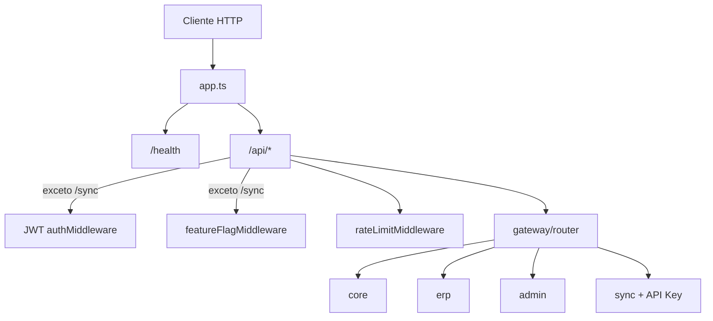

# Setes API — Documentação
**Escopo**: setes

API HTTP em **Node.js + Express + TypeScript** para o ecossistema **Gestão 2027 / Setes**. Ela centraliza autenticação, controle de módulos por cliente (multi-tenant), onboarding de novos tenants e sincronização de dados entre estabelecimentos locais e o banco central **MySQL/MariaDB**.

---

## Visão geral

| Aspecto | Descrição |
|--------|-----------|
| **Propósito** | Gateway de API multi-tenant com feature flags e sync push/pull |
| **Banco central** | Schema `setes_central` (tenants, flags, logs, API keys) |
| **Banco por cliente** | Um schema MySQL por tenant (ex.: `gestao_empresa_x`) |
| **Autenticação principal** | JWT (`Authorization: Bearer`) |
| **Autenticação de sync** | API Key no header `X-Api-Key` |
| **Porta padrão** | `3000` (variável `PORT`) |

Na inicialização, o servidor executa **migrations SQL** em todos os tenants ativos antes de aceitar requisições.

---

## Arquitetura



### Estrutura de pastas

```
src/
├── app.ts                 # Configuração Express e pipeline global
├── server.ts              # Bootstrap: migrations + listen
├── gateway/               # Middlewares e roteador principal
├── modules/               # Domínios da API (core, erp, admin, sync)
├── feature-flags/         # Habilitação de módulos por tenant
├── migrations/            # Runner SQL versionado por schema
└── shared/                # DB, logger, erros, tipos Express
```

Aliases TypeScript (`@gateway`, `@modules`, `@shared`, `@feature-flags`) estão definidos em `tsconfig.json`.

---

## Inicialização (`server.ts`)

1. Carrega variáveis de ambiente (`.env`).
2. Chama `runMigrationsForAllTenants()`:
   - Lista tenants ativos em `setes_central.tenants`.
   - Para cada `schema_name`, aplica arquivos em `src/migrations/sql/` que ainda não constam em `_migrations`.
3. Sobe o Express na porta configurada.

Se as migrations falharem, o processo encerra com código `1`.

---

## Pipeline HTTP (`app.ts`)

| Rota | Middlewares |
|------|-------------|
| `GET /health` | Nenhum — retorna `{ status: 'ok', ts }` |
| `/api/*` (exceto `/api/sync/*`) | JWT → feature flag → rate limit |
| `/api/sync/*` | Apenas rate limit + autenticação própria (API Key nas rotas de sync) |

**Rate limit:** 300 requisições por minuto por `tenantId` (ou IP se anônimo).

Erros não tratados retornam `500` com mensagem genérica e são logados.

---

## Gateway e autenticação

### JWT (`auth.middleware.ts`)

- Exige header `Authorization: Bearer <token>`.
- Valida com `JWT_SECRET`.
- Payload esperado (`TenantPayload`):

```ts
{
  tenantId: string
  userId: string
  role: 'setes_admin' | 'client_user'
  schemaName: string
}
```

- Dados válidos são anexados em `req.tenant`.

### Feature flags (`feature-flag.middleware.ts`)

- Extrai o módulo do path: `/api/<moduleKey>/...` (ex.: `erp` em `/api/erp/status`).
- Usuários com `role === 'setes_admin'` passam sem checagem.
- Demais tenants: consulta `feature_flags` (com cache em memória, TTL `FLAG_CACHE_TTL_MS`, padrão 60s).
- Tenant `tenantId === 'setes'` tem acesso total.
- Módulo desabilitado → `403`.

### Sync — API Key (`sync.auth.middleware.ts`)

- Header obrigatório: `X-Api-Key`.
- Resolve em `setes_central.sync_api_keys` (chave ativa → estabelecimento, tenant, schema).
- Cache em memória com TTL de 5 minutos.
- Resultado em `req.syncClient`.

---

## Módulos da API

### Core — `GET /api/core/info`

Retorna dados do tenant no banco central (`id`, `name`, `active`) usando `req.tenant.schemaName`. Requer módulo `core` habilitado (padrão no onboarding).

### ERP — `GET /api/erp/status`

Endpoint de exemplo que confirma que o módulo ERP está ativo para o tenant. Só responde se a feature flag `erp` estiver `enabled` (exceto admin Setes).

### Admin — `/api/admin/*`

Restrito a `role === 'setes_admin'`.

| Método | Rota | Função |
|--------|------|--------|
| `POST` | `/api/admin/tenants` | Onboarding de novo cliente |
| `GET` | `/api/admin/tenants` | Lista todos os tenants |

**Onboarding (`admin.service.ts`):**

1. Valida `schemaName` com regex `^gestao_[a-z0-9_]+$`.
2. Verifica se o schema já está registrado.
3. Gera `tenantId` (UUID).
4. Insere em `tenants` e cria flags padrão (`core` habilitado).
5. Executa migrations no novo schema.

### Sync — `/api/sync/*`

Autenticação independente (API Key). Não passa por JWT nem feature flags.

| Método | Rota | Descrição |
|--------|------|-----------|
| `POST` | `/push` | Envia lote de registros para uma tabela do schema do cliente |
| `GET` | `/pull` | Busca registros com `updated_at > since` |
| `GET` | `/status` | Cliente autenticado + estado da fila interna |
| `GET` | `/log` | Últimos registros de `setes_central.sync_log` do estabelecimento |

#### Push

Body JSON:

```json
{
  "table": "tb_product",
  "records": [ { "id": 1, "...": "..." } ]
}
```

- Máximo **5.000** registros por requisição.
- **≤ 50 registros:** upsert imediato (`INSERT ... ON DUPLICATE KEY UPDATE`).
- **> 50 registros:** enfileirado em memória; resposta **202** com `queued: true`.
- Nome de tabela validado: apenas `[a-z0-9_]`.
- Log em `sync_log` (sucesso/erro, duração, contagem).

#### Pull

Query params:

- `table` (obrigatório)
- `since` (datetime ISO, obrigatório)
- `limit` (opcional, máx. 500, padrão 500)

Retorna linhas onde `updated_at > since`, ordenadas por `updated_at`.

#### Fila (`sync.queue.ts`)

Fila **em memória**, processamento sequencial (`setImmediate`). Adequada para cargas moderadas; não persiste jobs entre reinícios do processo.

---

## Banco de dados

### Conexão (`shared/db/connection.ts`)

Pool `mysql2` apontando para `DB_NAME` (geralmente `setes_central`). Função `getConnection(schemaName)` faz `USE` no schema do tenant.

### Schema central (`setup.sql`)

Tabelas de referência para desenvolvimento/teste:

- `tenants` — clientes e nome do schema
- `feature_flags` — módulos habilitados por `tenant_id`

O código de sync também espera (no mesmo banco central):

- `sync_api_keys` — chaves por estabelecimento
- `sync_log` — auditoria de push/pull

Essas tabelas **não** estão no `setup.sql` atual; devem ser criadas conforme o ambiente de produção.

### Schemas de tenant

Cada cliente possui schema próprio (ex.: `gestao_loja_01`). Migrations em `src/migrations/sql/`:

| Arquivo | Conteúdo |
|---------|----------|
| `001_baseline.sql` | Schema completo do ERP (tabelas `tb_*`, utf8mb4, coluna `updated_at` para sync) |
| `002_triggers.sql` | Triggers do banco (aplicados em migration separada) |

Controle de versão por schema na tabela `_migrations`.

---

## Feature flags

| Camada | Responsabilidade |
|--------|------------------|
| `flag.repository.ts` | SELECT em `feature_flags` |
| `flag.service.ts` | Cache + `isModuleEnabled(tenantId, moduleKey)` |

No onboarding, apenas `core` é habilitado por padrão. Módulos como `erp` precisam ser inseridos/ativados manualmente (ou estendendo `insertDefaultFlags`).

---

## Variáveis de ambiente

Copie `.env.example` para `.env`:

| Variável | Uso |
|----------|-----|
| `PORT` | Porta HTTP |
| `JWT_SECRET` | Assinatura/validação JWT |
| `DB_HOST`, `DB_PORT`, `DB_USER`, `DB_PASSWORD`, `DB_NAME` | MySQL central |
| `FLAG_CACHE_TTL_MS` | TTL do cache de flags (ms) |

---

## Scripts e desenvolvimento

```bash
npm run dev      # tsx watch em src/server.ts
npm run build    # compila para dist/
npm run start    # node dist/server.js
npm test         # Jest (auth, feature flags, sync, onboarding)
```

`scripts/generate-token.ts` gera tokens JWT de exemplo para tenants de teste (Alpha, Beta, Setes Admin). Use o mesmo `JWT_SECRET` configurado no `.env`.

---

## Fluxos típicos

### 1. Cliente autenticado consulta ERP

```
GET /api/erp/status
Authorization: Bearer <jwt>
```

→ JWT válido → flag `erp` habilitada → `200` com dados do módulo.

### 2. Equipe Setes cria novo cliente

```
POST /api/admin/tenants
Authorization: Bearer <jwt setes_admin>
{ "name": "Loja X", "schemaName": "gestao_loja_x" }
```

→ Registro central + flags + migrations no novo schema → `201`.

### 3. PDV/loja sincroniza produtos

```
POST /api/sync/push
X-Api-Key: <chave do estabelecimento>
{ "table": "tb_product", "records": [...] }
```

→ API Key → upsert no schema do tenant → log em `sync_log`.

```
GET /api/sync/pull?table=tb_product&since=2024-06-01T00:00:00&limit=200
X-Api-Key: <chave>
```

→ Retorna alterações desde `since`.

---

## Módulo template

`src/modules/_template/` contém esqueleto de rotas/repository/service para novos módulos. **Não** está registrado em `gateway/router.ts`; serve apenas como referência de estrutura.

---

## Testes

Testes em `src/__tests__/` cobrem:

- Middleware de autenticação JWT
- Bloqueio/liberação por feature flag
- Fluxos de sync (push/pull, validações)
- Onboarding de tenant

Executam com Jest + Supertest em ambiente Node.

---

## Resumo

A **Setes API** é a camada de integração multi-tenant do Gestão 2027: protege rotas por JWT e flags por cliente, permite provisionar novos schemas com migrations automatizadas e oferece sync bidirecional (push/pull) para aplicações de campo via API Key, com fila para lotes grandes e auditoria centralizada de sincronização.
